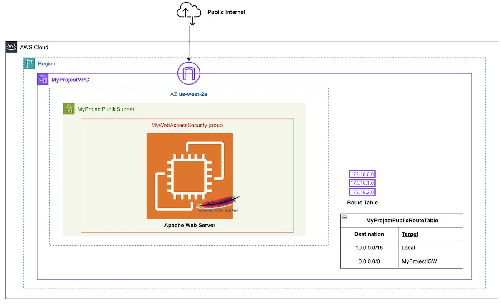

# AWS Deploy a Static Website on Amazon EC2 with Apache #

## Project Description

This project showcases the provisioning and configuration of an **Amazon EC2** instance within a custom **Virtual Private Cloud (VPC)** to host a static website. The solution prioritizes automation and security, utilizing **EC2 user data** to streamline the setup of the **Apache web server**. This approach avoids the complexity of CloudFormation templates while maintaining adherence to AWS best practices for **network architecture** and **security group configuration**. 

The instance is configured to serve the static HTML content from the standard Apache document root, **/var/www/html**. This project demonstrates a secure, scalable, and cost-effective method for hosting static websites on AWS.

## Architecture Overview

## Tools & Services used

* **Amazon EC2** – Virtual server to host and serve the web application
* **Amazon VPC** – Custom virtual network for secure resource isolation
* **Apache Web Server** – HTTP server used to host the static web page
* **AWS Security Groups** – Firewall rules to control traffic to the instance
* **EC2 instance access via SSH** – Secure command-line access to the virtual server for configuration and management
* **Bash & HTML** – Scripting and markup used for automation and the web page
* **Architecture Diagrams** - Visual representation of infrastructure components
(app.diagram.net)

## Complete Project

## Acknowledgments

- AWS re/Start / Factoría F5 mentoring
- AWS Documentation and Best Practices
- Open source tools that make setup and automation possible
